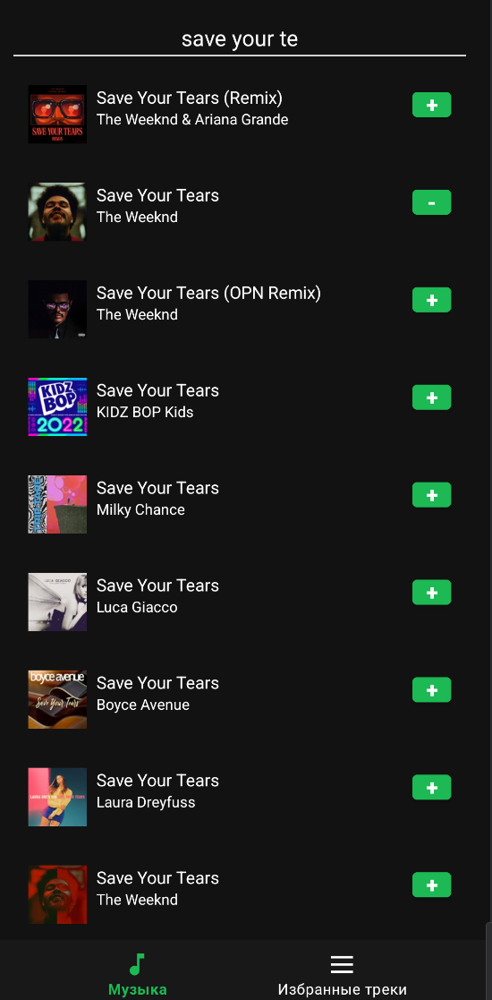
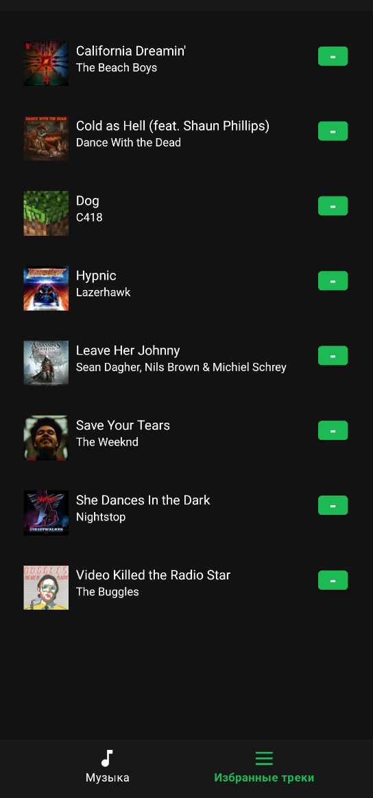

# AndGitProj - Music Search App

A Android music search application, built with Kotlin.

## Features

### Music Player
- Browse and search for music tracks
- View detailed track information
- Add tracks to favorites
- Responsive UI with Material Design components

### Other Features
- Clean architecture with MVVM pattern
- Jetpack Compose (if applicable)
- Dependency injection with Hilt
- Coroutines for asynchronous operations
- Offline support with Room database

## Tech Stack

- **Language**: Kotlin
- **Architecture**: MVVM (Model-View-ViewModel)
- **UI**: XML Layouts with Material Design Components
- **Dependency Injection**: Hilt
- **Networking**: Retrofit
- **Database**: Room
- **Image Loading**: Coil
- **Navigation**: Navigation Component
- **Asynchronous**: Kotlin Coroutines & Flow
- **Build System**: Gradle with Kotlin DSL

## Project Structure

```
app/
├── src/main/
│   ├── java/com/example/savch_andgit/music/
│   │   ├── data/                    # Data layer
│   │   │   ├── dto/                 # Data transfer objects
│   │   │   ├── local/               # Local database (Room)
│   │   │   │   ├── MusicDatabase.kt
│   │   │   │   ├── TrackDao.kt
│   │   │   │   └── TrackEntity.kt
│   │   │   ├── mapper/              # Mappers between layers
│   │   │   ├── repository/          # Repository implementation
│   │   │   └── service/             # API service (Retrofit)
│   │   │
│   │   ├── domain/                  # Business logic
│   │   │   ├── model/               # Domain models
│   │   │   ├── repository/          # Repository interfaces
│   │   │   └── usecase/             # Use cases
│   │   │
│   │   └── presentation/            # UI layer
│   │       ├── adapter/             # RecyclerView adapters
│   │       ├── state/               # UI state classes
│   │       ├── ui/                  # Fragments and activities
│   │       └── viewmodel/           # ViewModels
│   │
│   └── res/                        # Resources
│       ├── layout/                  # XML layouts
│       └── values/                  # Strings, colors, dimensions, etc.
│
└── build.gradle.kts                # Module-level build configuration
```

## Getting Started

### Prerequisites

- Android Studio Flamingo (2022.2.1) or later
- Android SDK 33 (API 33)
- JDK 17 or higher

### Installation

1. Clone the repository:
   ```bash
   git clone https://github.com/yourusername/andgitproj-COLL.git
   ```

2. Open the project in Android Studio

3. Build and run the app on an emulator

## Screenshots




## Configuration

The app uses the public [iTunes Search API](https://developer.apple.com/library/archive/documentation/AudioVideo/Conceptual/iTuneSearchAPI/) 
which doesn't require an API key. No additional configuration is needed to start using the app.

## Contributing

1. Fork the repository
2. Create a feature branch (`git checkout -b feature/AmazingFeature`)
3. Commit your changes (`git commit -m 'Add some AmazingFeature'`)
4. Push to the branch (`git push origin feature/AmazingFeature`)
5. Open a Pull Request

## Contact

Author link - [GitHub page](https://github.com/hairsprayhurricane)

Project Link: [github.com](https://github.com/hairsprayhurricane/andgitproj-COLL.git)

## Acknowledgments

- [Material Design Components](https://material.io/components)
- [Android Developer Documentation](https://developer.android.com/docs)
- [Kotlin Coroutines](https://kotlinlang.org/docs/coroutines-overview.html)
